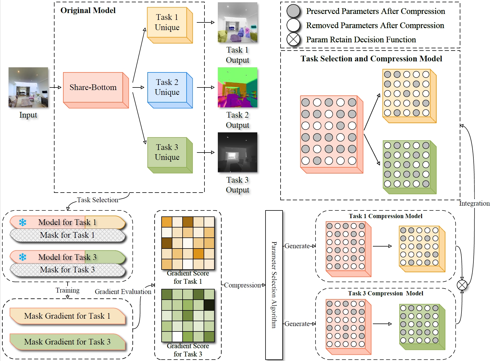

# CUT: Pruning Pre-Trained Multi-Task Models into Compact Models for Edge Devices

This repository is for CUT method.

## Introduction
As terminals directly serving users, edge devices occupy a pivotal position in the provision of intelligent services. With the rapid advancement of multi-task learning technology, multi-task services that provide users with a high-quality experience have emerged as a significant direction for future development. However, the current multi-task models are generally bulky, and user task requirements are diverse. Directly deploying such models on edge devices is bound to increase the burden on the devices and lead to task redundancy. In view of this, this paper proposes an edge-oriented task selection and model compression method, aiming to provide edge devices with intelligent models that consume low energy and allow task selection based on user needs. Specifically, this paper first dismantles each task in the basic multi-task model, then selects corresponding tasks according to user requirements, and ranks the importance of each task model's parameters using a data-driven approach. Finally, a parameter decision mechanism is employed to fuse shared parameters among tasks, resulting in a new, compressed intelligent model that only retains the tasks required by the user. Through experimental validation on three public image datasets, the method proposed in this paper demonstrates remarkable efficiency.

<div align="center">
  
  Overview of our method.
</div>

## Prerequisites
### Experiment Environment
Our implementation is in Pytorch.
We use `python3.11` and  please refer to [this link](https://docs.conda.io/projects/conda/en/latest/user-guide/tasks/manage-environments.html#creating-an-environment-with-commands) to create a `python3.11` conda environment.
Install the listed packages in the virual environment:
```
conda install pytorch==1.13.1 torchvision==0.14.1 torchaudio==0.13.1 pytorch-cuda=11.7 -c pytorch -c nvidia
conda install matplotlib
conda install -c menpo opencv
conda install pillow
conda install -c conda-forge tqdm
conda install -c anaconda pyyaml
conda install scikit-learn
conda install -c anaconda scipy
pip install tensorboardX
```

### Datasets
For NYU-V2, please download to [this link](https://drive.google.com/file/d/11pWuQXMFBNMIIB4VYMzi9RPE-nMOBU8g/view).

For CityScapes, please download to [this link](https://drive.google.com/file/d/1WrVMA_UZpoj7voajf60yIVaS_Ggl0jrH/view).

For Tiny-Taskonomy, please refer [this page](https://github.com/StanfordVL/taskonomy/tree/master/data) for instructions.

### Setup
Next, Modify the `DATA_ROOT` in the `config_cityscapes.py`, `config_nyuv2_3task.py` and `config_taskonomy.py` file to the path of the downloaded dataset. For example: `DATA_ROOT = "/data/nyu_v2/"`

## Train Baseline

Please refer to file `train_baseline.ipynb` for creating the base multi-task model in different datasets.

## Create Pruned Model
Use our method to create the task selection and Compression model. Please refer to file `create_pruning.ipynb`.

Use LTH method to compress the model. Please refer to file `create_pruning_baseline_LTH.ipynb`.

Use SNIP method to compress the model. Please refer to file `create_pruning_baseline_SNIP.ipynb`.

Use DiSparse method to compress the model. Please refer to [this link](https://github.com/SHI-Labs/DiSparse-Multitask-Model-Compression).

Use random method to compress the model. Please refer to file `create_pruning_baseline_random.ipynb`.

## Train Pruned Model
To train the Pruned Model, please refer to the file `train_prune.ipynb`.

## Acknowledgement
Some dataloading and evaluation code is from:
https://github.com/sunxm2357/AdaShare
